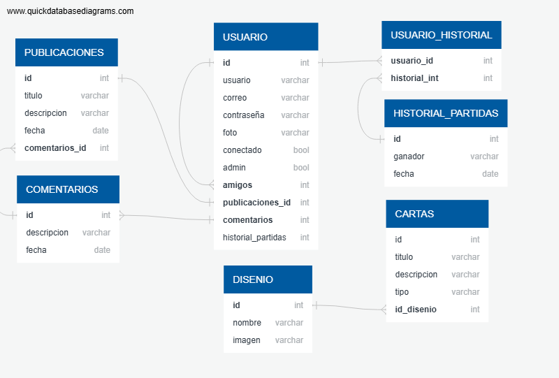

# Imploding Raccoons

Proyecto de fin de ciclo de DAM en el CPIFP Alan Turing 2025.

Juego movil y web inspirado en exploding kittens, de manera que la web sea la mesa donde se conecten todas las aplicaciones para jugar en ella, siendo cada aplicacion un jugador y la web el host de la partida.


## Anteproyecto
[Link Anteproyecto](https://docs.google.com/document/d/1dbNNTdb8QzlD5lRAiDT1_BaWJLE6FMgzKpKCUVFwbn4/edit?usp=sharing)

## Screenshots


## Documentation
[Link Trello](https://trello.com/b/0hjXPQi0/imploding-raccoons)

[Link Diario](https://docs.google.com/document/d/1ykSWTH5ng5t6gG1ch_GlARGJf0C_IkZsw6Mv_BXGNj8/edit?usp=sharing)

Diagrama Entidad Relacion:  
 

### Revision del proyecto
[Link del video de la revision del proyecto](https://drive.google.com/file/d/1wlLvvplchkN1s8ChJj8qEuTx1m5q71qR/view?usp=sharing)
[Link apk android](https://drive.google.com/file/d/15eNXxm5rMJ-DYa90k89Hx2IW83FckZyU/view?usp=sharing)
[Link web desplegada](https://i.ebayimg.com/images/g/RXoAAOSwcKdiuREc/s-l1200.png)
 
## Deployment

To deploy this project run

```bash
  aqui ira para ejecutarlo y eso
```
